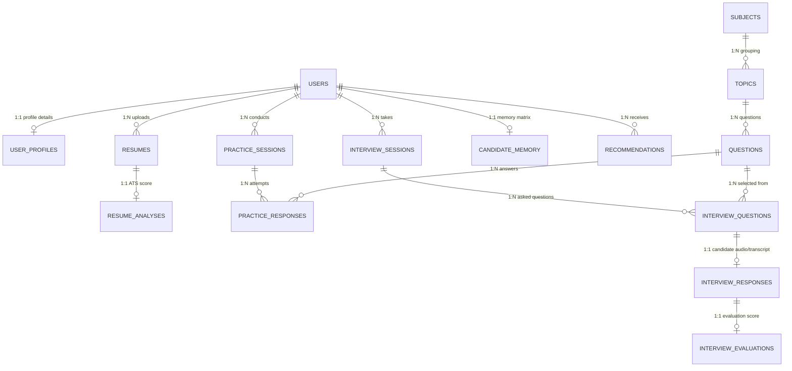

# HireCraft AI — Database Design Document
**Project Review 2: Database Architecture & Schema Specification**

---

## 1. Overview

* **Database Engine:** MySQL 8.0+ (Production), H2 Database (Development & Integration Testing)
* **Design Philosophy:** **Hybrid Relational + JSON Model**
  * **Relational Core:** Core entities (*Users, Profiles, Resumes, Sessions, Questions, Responses, Memory*) enforce strict relational integrity, foreign key constraints, 3NF normalization, and ACID compliance.
  * **JSON Extension:** Evolving, hierarchical, or dynamic data structures (*Skill Proficiency Matrices, Expected Concept Arrays, Missing Keywords, Evaluation Rubrics, Daily Recommended Task Lists*) are stored in native MySQL `JSON` columns.
* **Why This Hybrid Approach?**
  * Provides **relational consistency** (referential integrity, structured query power, join performance) alongside **NoSQL flexibility** (schema-less evolving JSON attributes).
  * Eliminates the operational complexity, cost, and cross-database transaction latency of managing a separate NoSQL database (e.g., MongoDB).

---

## 2. Entity Groups (Logical Grouping)

The database schema is organized into **6 Logical Entity Groups** comprising **14 Tables**:

```
                              HIRECRAFT AI DATABASE
                                        │
      ┌─────────────────┬───────────────┼───────────────┬─────────────────┐
      │                 │               │               │                 │
┌─────┴─────┐     ┌─────┴─────┐   ┌─────┴─────┐   ┌─────┴─────┐     ┌─────┴─────┐
│ Identity  │     │ Resume/   │   │ Question  │   │ Practice  │     │ Interview │
│ & Profile │     │   ATS     │   │   Bank    │   │   Flow    │     │   Flow    │
└─────┬─────┘     └─────┬─────┘   └─────┬─────┘   └─────┬─────┘     └─────┬─────┘
      │                 │               │               │                 │
  • users           • resumes       • subjects      • practice_       • interview_
  • user_           • resume_       • topics          sessions          sessions
    profiles          analyses      • questions     • practice_       • interview_
                                                      responses         questions
                                                                      • interview_
                                                                        responses
                                                                      • interview_
                                                                        evaluations
                                        │
                                 ┌──────┴──────┐
                                 │Intelligence │
                                 │    Layer    │
                                 └──────┬──────┘
                                        │
                                    • candidate_memory
                                    • recommendations
```

1. **Identity & Profile Group:** `users`, `user_profiles`
2. **Resume & ATS Group:** `resumes`, `resume_analyses`
3. **Question Bank Group:** `subjects`, `topics`, `questions`
4. **Practice Flow Group:** `practice_sessions`, `practice_responses`
5. **Interview Flow Group:** `interview_sessions`, `interview_questions`, `interview_responses`, `interview_evaluations`
6. **Intelligence & Memory Group:** `candidate_memory`, `recommendations`

---

## 3. Full Schema Specification

### Group 1: Identity & Profile

#### Table 1.1: `users`
Stores primary user credentials and security identity.
| Column | Type | Constraints | Description |
| :--- | :--- | :--- | :--- |
| `user_id` | BIGINT | PRIMARY KEY, AUTO_INCREMENT | Unique identifier for candidate |
| `name` | VARCHAR(100) | NOT NULL | Candidate full name |
| `email` | VARCHAR(150) | UNIQUE, NOT NULL, INDEX | Candidate login email address |
| `password_hash` | VARCHAR(255) | NOT NULL | BCrypt hashed password string |
| `role` | VARCHAR(20) | DEFAULT 'CANDIDATE' | System role (`CANDIDATE`, `ADMIN`) |
| `is_active` | BOOLEAN | DEFAULT TRUE | Account status flag |
| `created_at` | TIMESTAMP | DEFAULT CURRENT_TIMESTAMP | Account creation timestamp |
| `updated_at` | TIMESTAMP | DEFAULT CURRENT_TIMESTAMP ON UPDATE CURRENT_TIMESTAMP | Last record update timestamp |

#### Table 1.2: `user_profiles`
Stores candidate background, education, and social links.
| Column | Type | Constraints | Description |
| :--- | :--- | :--- | :--- |
| `profile_id` | BIGINT | PRIMARY KEY, AUTO_INCREMENT | Profile record ID |
| `user_id` | BIGINT | UNIQUE, FOREIGN KEY (`users.user_id`) ON DELETE CASCADE | Associated user ID |
| `degree` | VARCHAR(100) | NULLABLE | Degree name (e.g., B.Tech CSE) |
| `institution` | VARCHAR(150) | NULLABLE | University / College name |
| `graduation_year`| INT | NULLABLE | Expected / actual graduation year |
| `experience_level`| VARCHAR(50) | NOT NULL DEFAULT 'FRESHER' | `FRESHER`, `INTERN`, `1_2_YEARS`, `3_PLUS_YEARS` |
| `target_role_title`| VARCHAR(100)| NULLABLE | Desired role (e.g., Java Backend Engineer) |
| `github_url` | VARCHAR(255) | NULLABLE | GitHub profile URL |
| `linkedin_url` | VARCHAR(255) | NULLABLE | LinkedIn profile URL |
| `created_at` | TIMESTAMP | DEFAULT CURRENT_TIMESTAMP | Entry creation timestamp |

---

### Group 2: Resume & ATS

#### Table 2.1: `resumes`
Stores uploaded resume documents and extracted plain text.
| Column | Type | Constraints | Description |
| :--- | :--- | :--- | :--- |
| `resume_id` | BIGINT | PRIMARY KEY, AUTO_INCREMENT | Unique resume document ID |
| `user_id` | BIGINT | FOREIGN KEY (`users.user_id`) ON DELETE CASCADE | Owner candidate ID |
| `file_name` | VARCHAR(255) | NOT NULL | Original uploaded filename |
| `file_url` | VARCHAR(500) | NOT NULL | Server/S3 path to stored resume PDF |
| `raw_text` | MEDIUMTEXT | NOT NULL | Extracted unformatted text content |
| `version` | INT | DEFAULT 1 | Version counter for re-uploads |
| `created_at` | TIMESTAMP | DEFAULT CURRENT_TIMESTAMP | Upload timestamp |

#### Table 2.2: `resume_analyses`
Stores multi-dimensional ATS evaluation results and skill extraction arrays.
| Column | Type | Constraints | Description |
| :--- | :--- | :--- | :--- |
| `analysis_id` | BIGINT | PRIMARY KEY, AUTO_INCREMENT | Analysis entry ID |
| `resume_id` | BIGINT | UNIQUE, FOREIGN KEY (`resumes.resume_id`) ON DELETE CASCADE | Target resume ID |
| `ats_score` | INT | NOT NULL (0-100) | Overall ATS readiness score |
| `keyword_score` | INT | NOT NULL (0-100) | Target job keyword alignment score |
| `structure_score`| INT | NOT NULL (0-100) | Format & section organization score |
| `impact_score` | INT | NOT NULL (0-100) | Measurable achievements score |
| `extracted_skills`| JSON | NOT NULL | Extracted skill array `["Java", "Spring Boot", "SQL"]` |
| `missing_skills` | JSON | NOT NULL | Skills required by role but absent in resume |
| `issues_json` | JSON | NOT NULL | Formatted list of suggestions & formatting warnings |
| `created_at` | TIMESTAMP | DEFAULT CURRENT_TIMESTAMP | Analysis completion timestamp |

---

### Group 3: Question Bank

#### Table 3.1: `subjects`
Stores broad technical domain classifications.
| Column | Type | Constraints | Description |
| :--- | :--- | :--- | :--- |
| `subject_id` | BIGINT | PRIMARY KEY, AUTO_INCREMENT | Subject record ID |
| `subject_code` | VARCHAR(50) | UNIQUE, NOT NULL, INDEX | Code e.g., `DBMS`, `CN`, `OOPS`, `OS`, `DSA`, `APT` |
| `subject_name` | VARCHAR(100) | NOT NULL | Full name e.g., Database Management Systems |
| `description` | TEXT | NULLABLE | Domain description & overview |

#### Table 3.2: `topics`
Sub-categorizes subjects into specific granular topics.
| Column | Type | Constraints | Description |
| :--- | :--- | :--- | :--- |
| `topic_id` | BIGINT | PRIMARY KEY, AUTO_INCREMENT | Topic record ID |
| `subject_id` | BIGINT | FOREIGN KEY (`subjects.subject_id`) ON DELETE CASCADE | Parent subject ID |
| `topic_name` | VARCHAR(100) | NOT NULL, INDEX | Sub-topic e.g., `NORMALIZATION`, `TCP_UDP` |
| `description` | TEXT | NULLABLE | Topic learning objective |

#### Table 3.3: `questions`
Stores curated practice and interview questions with rubrics.
| Column | Type | Constraints | Description |
| :--- | :--- | :--- | :--- |
| `question_id` | BIGINT | PRIMARY KEY, AUTO_INCREMENT | Question record ID |
| `topic_id` | BIGINT | FOREIGN KEY (`topics.topic_id`) ON DELETE CASCADE | Associated sub-topic ID |
| `difficulty` | VARCHAR(20) | NOT NULL, INDEX | `BASIC`, `INTERMEDIATE`, `ADVANCED`, `SCENARIO` |
| `question_text` | TEXT | NOT NULL | Plain-text question phrasing |
| `expected_concepts`| JSON | NOT NULL | Array of required technical points for full credit |
| `evaluation_rubric`| JSON | NOT NULL | Concept weighting & grading criteria map |
| `created_at` | TIMESTAMP | DEFAULT CURRENT_TIMESTAMP | Creation timestamp |

---

### Group 4: Practice Flow

#### Table 4.1: `practice_sessions`
Tracks self-paced study and practice attempts.
| Column | Type | Constraints | Description |
| :--- | :--- | :--- | :--- |
| `session_id` | BIGINT | PRIMARY KEY, AUTO_INCREMENT | Practice session ID |
| `user_id` | BIGINT | FOREIGN KEY (`users.user_id`) ON DELETE CASCADE | Candidate ID |
| `subject_code` | VARCHAR(50) | NOT NULL | Subject targeted in session |
| `started_at` | TIMESTAMP | DEFAULT CURRENT_TIMESTAMP | Start timestamp |
| `completed_at` | TIMESTAMP | NULLABLE | End timestamp |

#### Table 4.2: `practice_responses`
Records individual candidate answers during practice sessions.
| Column | Type | Constraints | Description |
| :--- | :--- | :--- | :--- |
| `response_id` | BIGINT | PRIMARY KEY, AUTO_INCREMENT | Practice response ID |
| `session_id` | BIGINT | FOREIGN KEY (`practice_sessions.session_id`) ON DELETE CASCADE | Parent practice session ID |
| `question_id` | BIGINT | FOREIGN KEY (`questions.question_id`) ON DELETE CASCADE | Question attempted |
| `candidate_answer`| TEXT | NOT NULL | Text response provided by candidate |
| `is_correct` | BOOLEAN | NOT NULL | Automated correctness evaluation flag |
| `feedback_text` | TEXT | NULLABLE | AI-generated explanation & hint |
| `submitted_at` | TIMESTAMP | DEFAULT CURRENT_TIMESTAMP | Response submission time |

---

### Group 5: Interview Flow

#### Table 5.1: `interview_sessions`
Tracks high-level adaptive mock interview sessions.
| Column | Type | Constraints | Description |
| :--- | :--- | :--- | :--- |
| `session_id` | BIGINT | PRIMARY KEY, AUTO_INCREMENT | Unique mock interview session ID |
| `user_id` | BIGINT | FOREIGN KEY (`users.user_id`) ON DELETE CASCADE | Candidate ID |
| `interview_type` | VARCHAR(50) | NOT NULL | `TECHNICAL`, `BEHAVIORAL`, `HR`, `ROLE_BASED` |
| `target_role` | VARCHAR(100) | NOT NULL | Benchmark role e.g., `Backend Engineer` |
| `status` | VARCHAR(30) | DEFAULT 'IN_PROGRESS' | `IN_PROGRESS`, `COMPLETED`, `ABANDONED` |
| `overall_score` | DECIMAL(5,2) | NULLABLE | Consolidated score (0.00 - 100.00) |
| `started_at` | TIMESTAMP | DEFAULT CURRENT_TIMESTAMP | Session start time |
| `ended_at` | TIMESTAMP | NULLABLE | Session completion time |

#### Table 5.2: `interview_questions`
Maps specific questions selected dynamically for an interview session.
| Column | Type | Constraints | Description |
| :--- | :--- | :--- | :--- |
| `interview_question_id`| BIGINT| PRIMARY KEY, AUTO_INCREMENT | Record ID |
| `session_id` | BIGINT | FOREIGN KEY (`interview_sessions.session_id`) ON DELETE CASCADE | Parent interview session ID |
| `question_id` | BIGINT | FOREIGN KEY (`questions.question_id`) ON DELETE CASCADE | Selected base question ID |
| `sequence_order` | INT | NOT NULL | Turn order number in session (1, 2, 3...) |
| `is_follow_up` | BOOLEAN | DEFAULT FALSE | Flag indicating if question was an adaptive follow-up |
| `asked_at` | TIMESTAMP | DEFAULT CURRENT_TIMESTAMP | Asking timestamp |

#### Table 5.3: `interview_responses`
Captures voice transcripts and raw candidate responses during mock interviews.
| Column | Type | Constraints | Description |
| :--- | :--- | :--- | :--- |
| `response_id` | BIGINT | PRIMARY KEY, AUTO_INCREMENT | Interview turn response ID |
| `interview_question_id`| BIGINT| UNIQUE, FOREIGN KEY (`interview_questions.interview_question_id`) ON DELETE CASCADE | Corresponding asked question |
| `audio_url` | VARCHAR(500) | NULLABLE | Storage link to recorded candidate audio |
| `candidate_transcript`| TEXT | NOT NULL | Speech-to-Text transcribed answer text |
| `duration_seconds`| INT | NULLABLE | Answer speaking duration in seconds |
| `created_at` | TIMESTAMP | DEFAULT CURRENT_TIMESTAMP | Recording submission timestamp |

#### Table 5.4: `interview_evaluations`
Stores detailed multi-dimensional grading for each candidate response.
| Column | Type | Constraints | Description |
| :--- | :--- | :--- | :--- |
| `eval_id` | BIGINT | PRIMARY KEY, AUTO_INCREMENT | Evaluation ID |
| `response_id` | BIGINT | UNIQUE, FOREIGN KEY (`interview_responses.response_id`) ON DELETE CASCADE | Evaluated response ID |
| `technical_score` | INT | NOT NULL (0-100) | Concept accuracy & completeness score (70% weight) |
| `communication_score`| INT| NOT NULL (0-100) | Clarity, structure & filler score (30% weight) |
| `speaking_pace_wpm` | INT | NULLABLE | Speaking speed in Words Per Minute |
| `filler_word_count` | INT | DEFAULT 0 | Count of detected filler words (`um`, `like`) |
| `matched_concepts` | JSON | NOT NULL | Array of rubric concepts satisfied |
| `missing_concepts` | JSON | NOT NULL | Array of expected concepts omitted |
| `feedback_summary` | TEXT | NOT NULL | Concise constructive feedback narrative |
| `evaluated_at` | TIMESTAMP | DEFAULT CURRENT_TIMESTAMP | Evaluation completion timestamp |

---

### Group 6: Intelligence & Memory Layer

#### Table 6.1: `candidate_memory`
Stores the candidate's persistent skill matrix and long-term topic proficiency.
| Column | Type | Constraints | Description |
| :--- | :--- | :--- | :--- |
| `memory_id` | BIGINT | PRIMARY KEY, AUTO_INCREMENT | Unique memory record ID |
| `user_id` | BIGINT | UNIQUE, FOREIGN KEY (`users.user_id`) ON DELETE CASCADE | Target candidate ID |
| `topic_proficiency`| JSON | NOT NULL | Map of topic scores `{ "DBMS_NORM": 45, "TCP_IP": 82 }` |
| `weak_topics` | JSON | NOT NULL | List of identified active weak areas |
| `strong_topics` | JSON | NOT NULL | List of verified mastered areas |
| `interview_count` | INT | DEFAULT 0 | Total mock interviews completed |
| `practice_count` | INT | DEFAULT 0 | Total practice questions attempted |
| `last_updated` | TIMESTAMP | DEFAULT CURRENT_TIMESTAMP ON UPDATE CURRENT_TIMESTAMP | Memory mutation timestamp |

#### Table 6.2: `recommendations`
Stores daily customized preparation schedules generated by the Orchestrator.
| Column | Type | Constraints | Description |
| :--- | :--- | :--- | :--- |
| `rec_id` | BIGINT | PRIMARY KEY, AUTO_INCREMENT | Recommendation record ID |
| `user_id` | BIGINT | FOREIGN KEY (`users.user_id`) ON DELETE CASCADE | Candidate ID |
| `daily_plan_json` | JSON | NOT NULL | Scheduled tasks e.g., `[{ "task": "DBMS 3NF", "duration": "45m" }]` |
| `priority_topic` | VARCHAR(100) | NOT NULL | Primary weak area targeted for the day |
| `readiness_score` | INT | NOT NULL (0-100) | Current overall placement readiness percentage |
| `is_completed` | BOOLEAN | DEFAULT FALSE | Execution completion flag |
| `generated_at` | TIMESTAMP | DEFAULT CURRENT_TIMESTAMP | Plan generation timestamp |

---

## 4. Relationship Summary & Cardinality

### 4.1 Cardinality Matrix

```text
USERS (1)  ─────────── (1) USER_PROFILES
USERS (1)  ─────────── (N) RESUMES
USERS (1)  ─────────── (N) PRACTICE_SESSIONS
USERS (1)  ─────────── (N) INTERVIEW_SESSIONS
USERS (1)  ─────────── (1) CANDIDATE_MEMORY
USERS (1)  ─────────── (N) RECOMMENDATIONS

RESUMES (1) ────────── (1) RESUME_ANALYSES

SUBJECTS (1) ───────── (N) TOPICS
TOPICS (1) ─────────── (N) QUESTIONS

PRACTICE_SESSIONS (1)  ── (N) PRACTICE_RESPONSES
QUESTIONS (1) ───────── (N) PRACTICE_RESPONSES

INTERVIEW_SESSIONS (1) ── (N) INTERVIEW_QUESTIONS
QUESTIONS (1) ───────── (N) INTERVIEW_QUESTIONS
INTERVIEW_QUESTIONS (1) ─ (1) INTERVIEW_RESPONSES
INTERVIEW_RESPONSES (1) ─ (1) INTERVIEW_EVALUATIONS
```

---

### 4.2 Complete ER Diagram



---

## 5. Design Rationale & Architectural Decisions

### 5.1 Strategic Use of Native `JSON` Columns
Instead of creating dozens of small lookup tables for dynamic structures, MySQL `JSON` columns are used for:
1. **`extracted_skills` & `missing_skills`** in `resume_analyses`: Avoids creating a complex junction table (`resume_skill_matches`) for transient analysis strings.
2. **`expected_concepts` & `evaluation_rubric`** in `questions`: Allows concept weights to be defined flexibly per question without constraining rubric formats.
3. **`topic_proficiency`** in `candidate_memory`: Enables storing a dynamic Key-Value dictionary (`{ "DBMS_NORM": 75, "OS_DEADLOCK": 40 }`) that automatically expands as new topics are added to the question bank.
4. **`daily_plan_json`** in `recommendations`: Permits dynamic scheduling structures generated by the AI Orchestrator.

---

### 5.2 Performance Optimization & Indexing Strategy
To guarantee fast query execution during live mock interviews, the following indexes are applied:
* **`users.email` (UNIQUE INDEX):** Fast authentication lookups during login.
* **`subjects.subject_code` (INDEX):** Instant filtering of question banks by subject.
* **`topics.topic_name` (INDEX):** Speeds up topic-level proficiency lookups.
* **`questions.difficulty` (INDEX):** Accelerates adaptive question selection based on current candidate difficulty tier.
* **`interview_sessions.user_id` (INDEX):** Rapid retrieval of candidate interview history.

---

### 5.3 Normalization Approach (3NF Core)
All relational tables (`users`, `user_profiles`, `resumes`, `subjects`, `topics`, `questions`, `interview_sessions`, `interview_responses`, `interview_evaluations`) strictly adhere to **Third Normal Form (3NF)**:
* Every non-key attribute depends strictly on the primary key (no transitive dependencies).
* Foreign keys explicitly maintain referential integrity with cascading updates/deletes where appropriate (`ON DELETE CASCADE`).

---
*This document constitutes the official Database Design Specification for HireCraft AI (Review 2).*
