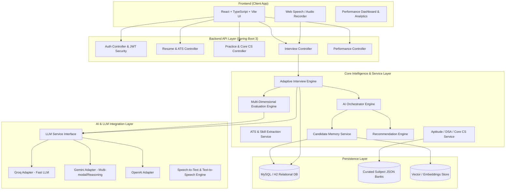
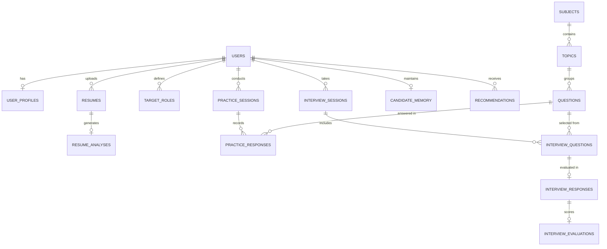
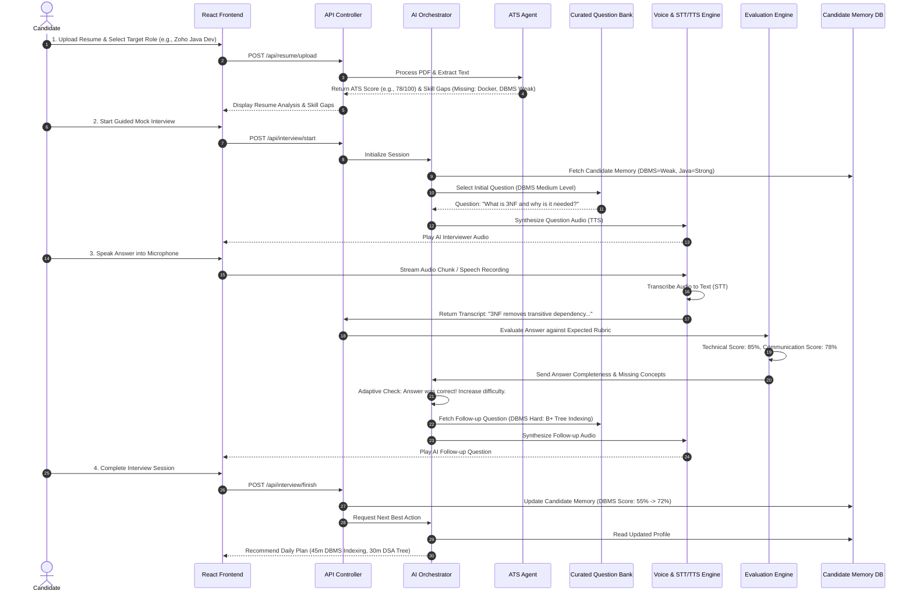

# HireCraft AI — System Design & Master Reference Document
**Project Review 2: System Design, Database Architecture & Technical Workflows**

---

## 📋 1. Executive Summary & Project Pitch

### 1.1 Project Identity
* **Project Name:** HireCraft AI
* **Category:** AI-Powered Personalized Career Preparation & Adaptive Interview Platform
* **Primary Target Audience:** College Students, Freshers, Placement Aspirants, Job Seekers, Software Developer Candidates.
* **Core Value Proposition:** HireCraft AI transforms fragmented career preparation into a continuous, personalized, closed-loop AI coaching system. It connects Resume ATS Scoring $\rightarrow$ Skill Gap Analysis $\rightarrow$ Targeted Prep (Aptitude, DSA, Core CS) $\rightarrow$ Adaptive Voice/Text Mock Interviews $\rightarrow$ Multi-Dimensional Evaluation $\rightarrow$ Long-Term Candidate Memory $\rightarrow$ Dynamic Next-Best-Action Recommendations.

---

### 1.2 The 30-Second Elevator Pitch (For Review Panel)
> *"Most students prepare for placements using disconnected platforms—one tool for resume, another for aptitude, LeetCode for DSA, YouTube for Core CS, and friends for mock interviews. None of these tools talk to each other.*
> 
> *HireCraft AI brings all these into **one unified system governed by an AI Orchestrator**. It analyzes the candidate's resume and target job role, identifies specific skill gaps, builds a custom preparation path, conducts adaptive voice mock interviews, evaluates technical and communication performance, remembers weaknesses across sessions, and continuously recommends what the candidate should practice next. **It is not just an interview chatbot; it is a complete, closed-loop AI career coach.***"

---

### 1.3 The Core Problem vs. HireCraft Solution

```
┌─────────────────────────────────────────────────────────────────────────┐
│                           THE FRAGMENTED STATUS QUO                     │
│  Resume Tool   Aptitude Site   LeetCode (DSA)   YouTube (CS)   Mock Chat│
│      │               │               │               │             │    │
│      ▼               ▼               ▼               ▼             ▼    │
│   [ No Continuity | No Central Memory | No Adaptive Recommendation ]   │
└─────────────────────────────────────────────────────────────────────────┘
                                    │
                                    ▼ HIRECRAFT AI SOLUTION
┌─────────────────────────────────────────────────────────────────────────┐
│                         HIRECRAFT AI CLOSED LOOP                        │
│                                                                         │
│    Candidate Profile ──► ATS & Role Gap Analysis ──► Adaptive Prep     │
│             ▲                                               │           │
│             │                                               ▼           │
│      Next Recommendation ◄── Candidate Memory ◄── AI Voice Interview   │
└─────────────────────────────────────────────────────────────────────────┘
```

---

## 🏗️ 2. System Architecture & Component Design

### 2.1 High-Level Architecture
HireCraft AI is built using a **Modular Monolith** pattern. This architecture ensures high cohesion and clean separation of concerns without introducing premature microservice network latency or deployment overhead.



---

### 2.2 The Multi-Agent Orchestration Model
Although implemented as clean Java services, the system operates conceptually as specialized **Agents** coordinated by the **Central AI Orchestrator**:

1. **Career Memory Agent:** Maintains candidate profile, skill masteries, weaknesses, and history.
2. **Resume & ATS Agent:** Parses PDF/Docx resumes, extracts entities, and scores against job descriptions.
3. **Job Analysis Agent:** Analyzes target job descriptions to define required skill vectors.
4. **Preparation Agents (Aptitude, DSA, Core CS):** Serves difficulty-calibrated practice problems from curated question banks (`cn.json`, `dbms.json`, `oops.json`, `os.json`).
5. **Adaptive Interview Agent:** Manages real-time interview state, selects context-aware questions, and generates deep multi-turn follow-ups based on candidate responses.
6. **Evaluation Agent:** Benchmarks technical completeness against expected rubric concepts and analyzes communication pace/structure.
7. **Recommendation Agent:** Runs candidate state through the closed-loop algorithm to generate the daily "Next Best Action".

---

### 2.3 LLM Provider Independence (Strategy Pattern)
To avoid vendor lock-in and optimize for latency vs. cost, the backend exposes a unified `LLMService` interface.

```
                  ┌──────────────────────┐
                  │  <<interface>>       │
                  │    LLMService        │
                  └──────────┬───────────┘
                             │
       ┌─────────────────────┼─────────────────────┐
       ▼                     ▼                     ▼
┌──────────────┐      ┌──────────────┐      ┌──────────────┐
│ GroqLLMImpl  │      │ GeminiLLMImpl│      │ OpenAILLMImpl│
│ (Low-latency)│      │ (Reasoning)  │      │ (Fallback)   │
└──────────────┘      └──────────────┘      └──────────────┘
```

* **Why Groq?** Sub-100ms response time makes it ideal for real-time speech/voice interviews.
* **Why Gemini?** Excellent for deep evaluation, document synthesis (Resume ATS), and complex reasoning.

---

## 🗄️ 3. Database Architecture & ER Diagram

### 3.1 Relational Entity-Relationship Diagram (ERD)



---

### 3.2 Detailed Database Schema Specification

#### 1. Table: `users`
Stores primary user identity and authentication credentials.
| Column | Type | Constraints | Description |
| :--- | :--- | :--- | :--- |
| `user_id` | BIGINT | PRIMARY KEY, AUTO_INC | Unique identifier for candidate |
| `name` | VARCHAR(100) | NOT NULL | Full name of the candidate |
| `email` | VARCHAR(150) | UNIQUE, NOT NULL | Candidate email address |
| `password_hash` | VARCHAR(255) | NOT NULL | BCrypt hashed password |
| `created_at` | TIMESTAMP | DEFAULT CURRENT_TIMESTAMP | Account creation timestamp |
| `updated_at` | TIMESTAMP | ON UPDATE CURRENT_TIMESTAMP| Last profile update timestamp |

#### 2. Table: `user_profiles`
Stores educational background and professional metadata.
| Column | Type | Constraints | Description |
| :--- | :--- | :--- | :--- |
| `profile_id` | BIGINT | PRIMARY KEY, AUTO_INC | Profile entry ID |
| `user_id` | BIGINT | FOREIGN KEY (`users.user_id`) | Associated user |
| `education` | VARCHAR(200) | NULLABLE | Degree, College, Graduation Year |
| `experience_level`| VARCHAR(50) | NOT NULL | `FRESHER`, `1_2_YEARS`, `INTERN` |
| `github_url` | VARCHAR(255) | NULLABLE | Candidate GitHub link |
| `linkedin_url` | VARCHAR(255) | NULLABLE | Candidate LinkedIn link |

#### 3. Table: `resumes` & `resume_analyses`
Stores uploaded resume documents and ATS analysis breakdown.
| Column | Type | Constraints | Description |
| :--- | :--- | :--- | :--- |
| `resume_id` | BIGINT | PRIMARY KEY, AUTO_INC | Unique resume document ID |
| `user_id` | BIGINT | FOREIGN KEY (`users.user_id`) | Associated user |
| `file_url` | VARCHAR(500) | NOT NULL | Path/URL to stored resume PDF |
| `raw_text` | TEXT | NOT NULL | Extracted plain text |
| `ats_score` | INT | NOT NULL (0-100) | Overall ATS Compatibility Score |
| `keyword_score` | INT | NOT NULL (0-100) | Match against target job keywords |
| `structure_score`| INT | NOT NULL (0-100) | Formatting and section score |
| `extracted_skills`| JSON | NOT NULL | Extracted skills array `["Java", "SQL"]` |
| `missing_skills` | JSON | NOT NULL | Skills missing for target role |
| `issues_json` | JSON | NOT NULL | Structuring/Content issue list |

#### 4. Table: `subjects`, `topics`, & `questions`
Stores the curated subject hierarchy and pre-validated question banks (`cn`, `dbms`, `oops`, `os`).
| Column | Type | Constraints | Description |
| :--- | :--- | :--- | :--- |
| `question_id` | BIGINT | PRIMARY KEY, AUTO_INC | Unique question ID |
| `subject_code` | VARCHAR(50) | NOT NULL, INDEX | `DBMS`, `CN`, `OOPS`, `OS`, `DSA`, `APT` |
| `topic_name` | VARCHAR(100) | NOT NULL | Sub-topic e.g., `TCP_UDP`, `NORMALIZATION` |
| `difficulty` | VARCHAR(20) | NOT NULL | `BASIC`, `INTERMEDIATE`, `ADVANCED`, `SCENARIO` |
| `question_text` | TEXT | NOT NULL | Question phrasing |
| `expected_concepts`| JSON | NOT NULL | Core concepts required for full marks |
| `evaluation_rubric`| JSON | NOT NULL | Scoring criteria & keyword weights |

#### 5. Table: `interview_sessions`, `interview_responses`, & `interview_evaluations`
Tracks active/past adaptive mock interviews and evaluation scores.
| Column | Type | Constraints | Description |
| :--- | :--- | :--- | :--- |
| `session_id` | BIGINT | PRIMARY KEY, AUTO_INC | Unique mock interview session ID |
| `user_id` | BIGINT | FOREIGN KEY (`users.user_id`) | Candidate ID |
| `interview_type` | VARCHAR(50) | NOT NULL | `TECHNICAL`, `BEHAVIORAL`, `HR`, `ROLE_BASED` |
| `target_role` | VARCHAR(100) | NOT NULL | Role benchmark e.g., `Backend Developer` |
| `overall_score` | DECIMAL(5,2) | NULLABLE | Consolidated score (0.00 - 100.00) |
| `started_at` | TIMESTAMP | DEFAULT CURRENT_TIMESTAMP | Interview start time |
| `ended_at` | TIMESTAMP | NULLABLE | Interview completion time |
| `response_id` | BIGINT | PRIMARY KEY, AUTO_INC | Individual turn response ID |
| `question_id` | BIGINT | FOREIGN KEY (`questions.question_id`)| Selected question ID |
| `candidate_transcript`| TEXT | NOT NULL | STT converted response text |
| `technical_score`| INT | NOT NULL (0-100) | Accuracy & conceptual score |
| `communication_score`| INT | NOT NULL (0-100) | Clarity, structure, filler count |
| `feedback_json` | JSON | NOT NULL | Strong points & missing concepts |

#### 6. Table: `candidate_memory`
Stores the candidate's dynamic proficiency matrix and topic mastery levels.
| Column | Type | Constraints | Description |
| :--- | :--- | :--- | :--- |
| `memory_id` | BIGINT | PRIMARY KEY, AUTO_INC | Unique memory record ID |
| `user_id` | BIGINT | UNIQUE, FOREIGN KEY (`users.user_id`)| Candidate ID |
| `topic_proficiency`| JSON | NOT NULL | Map of `{ "DBMS_NORM": 45, "TCP_IP": 82 }` |
| `weak_topics` | JSON | NOT NULL | List of identified active weak areas |
| `strong_topics` | JSON | NOT NULL | List of verified mastered areas |
| `interview_count`| INT | DEFAULT 0 | Total mock interviews completed |
| `last_updated` | TIMESTAMP | ON UPDATE CURRENT_TIMESTAMP| Timestamp of last state mutation |

#### 7. Table: `recommendations`
Stores daily customized preparation schedules generated by the Orchestrator.
| Column | Type | Constraints | Description |
| :--- | :--- | :--- | :--- |
| `rec_id` | BIGINT | PRIMARY KEY, AUTO_INC | Recommendation record ID |
| `user_id` | BIGINT | FOREIGN KEY (`users.user_id`) | Candidate ID |
| `daily_plan_json`| JSON | NOT NULL | Recommended tasks with allocated time |
| `priority_topic` | VARCHAR(100) | NOT NULL | Primary weak area to target |
| `is_completed` | BOOLEAN | DEFAULT FALSE | Completion status flag |
| `generated_at` | TIMESTAMP | DEFAULT CURRENT_TIMESTAMP | Creation timestamp |

---

### 3.3 Hybrid Memory Model (Structured + Semantic)
To give the AI candidate awareness across sessions, HireCraft implements a **Dual-Layer Memory**:

1. **Structured Memory (RDBMS):** Stores exact quantitative metrics (topic scores, test attempt counts, weakness lists, pass/fail thresholds).
2. **Semantic Memory (Vector Embeddings):** Stores verbatim transcripts of candidate explanations and nuanced interview feedback. When a candidate answers a question on a related topic, RAG (Retrieval-Augmented Generation) fetches past answers to verify if the candidate corrected previous mistakes!

---

## 🔄 4. End-to-End Workflows & Data Flow

### 4.1 Master End-to-End Candidate Journey Diagram



---

### 4.2 Adaptive Questioning Logic (Closed Learning Loop)

```
                       [ Candidate Answer Received ]
                                    │
                                    ▼
                     [ Technical Evaluation Engine ]
                                    │
            ┌───────────────────────┴───────────────────────┐
            ▼                                               ▼
   [ Answer Correct / Strong ]                    [ Answer Weak / Partial ]
            │                                               │
            ▼                                               ▼
   Increase Difficulty                            Maintain / Lower Difficulty
            │                                               │
            ▼                                               ▼
 Select Harder Question OR                        Ask Deep Concept Clarification
 Generate Deep Follow-up                          (Target Missing Rubric Item)
            │                                               │
            └───────────────────────┬───────────────────────┘
                                    │
                                    ▼
                      [ Update Candidate Memory ]
                                    │
                                    ▼
                [ Adjust Recommendation Engine Plan ]
```

---

## ⚙️ 5. Major Modules & Technical Implementation

### 5.1 Module 1: AI Career Profile & Long-Term Candidate Memory
* **Function:** Serves as the candidate's persistent profile state.
* **Why it matters:** Eliminates redundant questions. If a candidate previously demonstrated 90% mastery in Java Collections, the system skips basic Java questions and focuses on weak areas (e.g., DBMS Concurrency).
* **Implementation:** `MemoryService.java` manages JSON-based topic proficiency maps in MySQL and handles state updates after every interview or practice session.

---

### 5.2 Module 2: Resume Parser & ATS Scoring Engine
* **Function:** Parses uploaded PDF/Word resumes using Apache Tika / PDFBox, extracts contact details, skills, education, projects, and experiences.
* **ATS Scoring Formula:**
$$\text{ATS Score} = (0.4 \times \text{Skill Match}) + (0.3 \times \text{Keyword Relevance}) + (0.2 \times \text{Structure Score}) + (0.1 \times \text{Impact Quantification})$$
* **Output:** Provides instant feedback on missing keywords, weak bullet points, and compatibility against the target role.

---

### 5.3 Module 3: Structured Question Banks (`backend/Core_Subjects`)
* **Function:** Provides high-quality, pre-curated question banks for major computer science fundamentals instead of relying on unpredictable runtime LLM question generation.
* **Curated Files in Workspace:**
  * `cn.json`: Computer Networks (OSI, TCP/IP, TCP vs UDP, HTTP/HTTPS, DNS, Routing)
  * `dbms.json`: Database Management Systems (Normalization, SQL Joins, ACID, Indexing, Transactions)
  * `oops.json`: Object-Oriented Programming (Abstraction, Encapsulation, Inheritance, Polymorphism, SOLID)
  * `os.json`: Operating Systems (Process vs Thread, Deadlocks, Virtual Memory, Paging, CPU Scheduling)
* **Structure of Question Bank Item:**
```json
{
  "id": "DBMS_NORM_02",
  "subject": "DBMS",
  "topic": "Normalization",
  "difficulty": "INTERMEDIATE",
  "question": "Explain 3rd Normal Form (3NF) and how it differs from BCNF.",
  "expected_concepts": [
    "Removal of transitive dependencies",
    "Super key requirement for BCNF",
    "Functional dependency X -> Y"
  ],
  "rubric": {
    "transitive_dependency_weight": 40,
    "bcnf_superkey_weight": 40,
    "examples_weight": 20
  }
}
```
* **Strategic Advantage:** Ensures 100% curriculum coverage, predictable evaluation rubrics, and massive LLM token savings.

---

### 5.4 Module 4: Adaptive AI Voice/Text Interview Engine
* **Function:** Conducts interactive, multi-turn mock interviews.
* **Voice Pipeline:**
  1. **Capture:** Client records candidate voice via HTML5 MediaRecorder API / Web Speech API.
  2. **STT (Speech-to-Text):** Transcribes audio using Web Speech API or Whisper STT.
  3. **Contextual Evaluation:** `InterviewService.java` checks candidate answer against `expected_concepts`.
  4. **Adaptive Response Generation:** Groq LLM generates conversational interviewer response (e.g., "Good point about transitive dependency! But what happens if a table has multiple overlapping candidate keys?").
  5. **TTS (Text-to-Speech):** Synthesizes response into voice audio output for the candidate.

---

### 5.5 Module 5: Multi-Dimensional Evaluation Engine
Evaluates candidate answers across two distinct axes without penalizing non-native speakers unfairly:

```
                           EVALUATION SCORECARD
┌──────────────────────────────────────┬──────────────────────────────────────┐
│       TECHNICAL DIMENSION (70%)      │     COMMUNICATION DIMENSION (30%)   │
├──────────────────────────────────────┼──────────────────────────────────────┤
│ • Concept Coverage (% of Rubric)     │ • Speaking Pace (Words per minute)   │
│ • Technical Accuracy                 │ • Answer Structure (STAR / Direct)   │
│ • Terminology & Precision            │ • Filler Word Density (um, like, etc)│
│ • Edge Case Awareness                │ • Conciseness vs. Verbosity          │
└──────────────────────────────────────┴──────────────────────────────────────┘
```

---

### 5.6 Module 6: Dynamic Recommendation Engine ("Next Best Action")
* **Function:** Evaluates current Candidate Memory against the Target Role benchmark and generates a personalized daily action plan.
* **Example Output:**
```json
{
  "date": "2026-08-13",
  "target_role": "Backend Engineer",
  "readiness_score": "71%",
  "recommended_actions": [
    { "task": "Practice DBMS Indexing & B+ Trees", "duration": "45 mins", "type": "PRACTICE" },
    { "task": "Review CN TCP Congestion Control", "duration": "30 mins", "type": "CORE_CS" },
    { "task": "15-Minute Adaptive Mock Interview (DBMS)", "duration": "15 mins", "type": "MOCK_INTERVIEW" }
  ]
}
```

---

## 💻 6. Codebase Architecture & Technical Stack

### 6.1 Technology Stack Table
| Component | Technology | Rationale |
| :--- | :--- | :--- |
| **Frontend UI** | React 18, TypeScript, Vite, Tailwind CSS | High performance, typed UI components, fast HMR |
| **Audio / Voice** | HTML5 Audio API, Web Speech API / WebRTC | Browser-native low-latency voice capture |
| **Backend Framework**| Java 21, Spring Boot 3.x, Spring Web | Enterprise robustness, strong typing, clean layered architecture |
| **Security** | Spring Security 6, JWT (JSON Web Tokens), BCrypt | Secure stateless API authentication |
| **Data Access** | Spring Data JPA, Hibernate, Lombok | ORM efficiency, clean repository pattern |
| **Database** | MySQL / H2 (Development & Testing) | Relational integrity for user profiles, session records, and rubrics |
| **AI Integration** | Groq (Fast LLM), Gemini 1.5, OpenAI API | Multi-provider fallback strategy |

---

### 6.2 Backend Package & Directory Structure
```text
com.hirecraft.voiceinterview/
├── config/
│   ├── SecurityConfig.java         # Spring Security & CORS setup
│   ├── RedisConfig.java            # Session / Rate-limiting cache config
│   └── AppConfig.java              # RestTemplate & Bean definitions
├── controller/
│   ├── AuthController.java         # Register, Login, JWT issuance
│   ├── ResumeController.java       # Resume PDF upload & ATS endpoints
│   ├── InterviewController.java    # Mock interview lifecycle APIs
│   ├── QuestionController.java     # Core subject question bank APIs
│   └── PerformanceController.java  # Dashboard & Analytics endpoints
├── dto/
│   ├── request/                    # Request payload DTOs
│   └── response/                   # Structured JSON response DTOs
├── entity/
│   ├── User.java                   # User credentials JPA entity
│   ├── UserProfile.java            # Candidate metadata entity
│   ├── Question.java               # Question bank JPA entity
│   ├── InterviewSession.java       # Interview session entity
│   ├── InterviewResponse.java      # Transcript & turn score entity
│   └── CandidateMemory.java        # Skill matrix persistence entity
├── repository/
│   ├── UserRepository.java
│   ├── QuestionRepository.java
│   ├── InterviewSessionRepository.java
│   └── CandidateMemoryRepository.java
├── security/
│   ├── JwtService.java             # Token generation & validation
│   └── JwtAuthFilter.java          # Per-request authentication filter
└── service/
    ├── AuthService.java            # Business logic for auth
    ├── ResumeService.java          # ATS scoring & parsing logic
    ├── InterviewService.java       # Adaptive interview orchestrator
    ├── EvaluationService.java      # Scoring & rubric evaluation
    ├── MemoryService.java          # Candidate profile state manager
    └── LLMService.java             # AI provider abstraction interface
```

---

## 🎯 7. Review 2 Defense & Viva Guide (Panel Q&A)

Prepare for these expected questions during tomorrow's Review 2 presentation:

### Q1: "Why did you build pre-curated question banks (`cn.json`, `dbms.json`) instead of asking the LLM to generate questions live?"
> **Answer:** *"Relying 100% on live LLM question generation introduces three major flaws: (1) **Unpredictable Quality & Hallucination**, (2) **High Latency and Token Costs**, and (3) **Inconsistent Evaluation Criteria**. 
> By pre-curating standard CS subjects with verified expected concepts and rubrics, we guarantee curriculum coverage and deterministic scoring. The LLM is then used at runtime for what it does best: **evaluating the candidate's natural language answer and generating dynamic, answer-aware follow-up questions.**"*

---

### Q2: "How does your AI Orchestrator adjust difficulty adaptively?"
> **Answer:** *"When a candidate submits an answer, the Evaluation Engine checks it against the target question's `expected_concepts`. If the candidate achieves >80% conceptual coverage, the Orchestrator marks the topic level as strong, updates Candidate Memory, and selects a higher-difficulty question or a deeper scenario follow-up. If the answer is partial (<50%), the system maintains or lowers the difficulty and asks a clarifying question targeting the specific missing concept."*

---

### Q3: "How do you evaluate communication skills without penalizing candidates with different accents?"
> **Answer:** *"We separate Technical Accuracy (70%) from Communication (30%). Technical evaluation relies strictly on semantic match against expected concepts. Communication evaluation measures structural metrics—such as speaking pace (words per minute), filler word frequency ('um', 'ah'), and directness of response—rather than accent or pronunciation. This ensures fair, unbiased assessment."*

---

### Q4: "Why use a Relational Database (MySQL) alongside JSON storage?"
> **Answer:** *"Core entities (Users, Sessions, Questions) require strong relational integrity, foreign key constraints, and transactional consistency, which MySQL provides. Complex, evolving data structures—like dynamic skill proficiency maps, missing keyword lists, and evaluation rubrics—are stored as native JSON columns within MySQL. This gives us the best of both worlds: relational consistency with NoSQL schema flexibility."*

---

### Q5: "What makes HireCraft AI different from existing AI mock interview tools on the web?"
> **Answer:** *"Existing tools are static, fragmented single-turn chatbots. HireCraft AI is a **closed-loop learning system**. It connects resume analysis directly to skill gap identification, targeted prep, adaptive voice mock interviews, multi-dimensional evaluation, long-term candidate memory, and dynamic daily recommendations. It remembers past mistakes across sessions and continuously guides the student until placement readiness is achieved."*

---

## 🚀 8. Implementation Roadmap & Project Progress

```
┌──────────────────────────────────────────────────────────────────────────┐
│ PHASE 1: MVP CORE (COMPLETED / IN PROGRESS)                              │
│  [x] System Architecture & Database Design (Review 2 Deliverable)        │
│  [x] Curated Core CS Question Banks (CN, DBMS, OOPS, OS)                 │
│  [x] Spring Boot API Layer & JWT Security Setup                          │
│  [x] React + TypeScript + Tailwind Frontend Foundation                   │
├──────────────────────────────────────────────────────────────────────────┤
│ PHASE 2: ADAPTIVE ENGINE & MEMORY (NEXT STEP)                            │
│  [ ] ATS Resume Parser Integration                                       │
│  [ ] Dual-Layer Candidate Memory Persistence                             │
│  [ ] Adaptive Follow-up Logic & Dynamic Recommendation Engine           │
├──────────────────────────────────────────────────────────────────────────┤
│ PHASE 3: ADVANCED VOICE & ANALYTICS (FINAL MILESTONE)                    │
│  [ ] Real-Time WebSpeech / WebRTC Voice Interview Interface              │
│  [ ] Communication Analytics (Pace, Filler word counter)                 │
│  [ ] Comprehensive Placement Readiness Dashboard                         │
└──────────────────────────────────────────────────────────────────────────┘
```

---
*This document serves as the Master System Design Specification & Review 2 Reference for HireCraft AI.*
