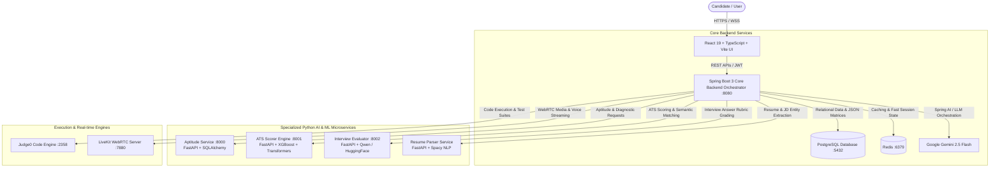

<p align="center">
  
  
  
  
  
</p>

<h1 align="center">🚀 HireCraft AI</h1>
<h3 align="center">Agentic AI-Powered Intelligent Interview Preparation & Placement Readiness Ecosystem</h3>

<p align="center">
  <b>A unified, closed-loop career preparation platform that connects Resume Intelligence, ATS Scoring, Adaptive Diagnostic Aptitude, DSA Coding Arena, Real-time Voice Mock Interviews, and Long-Term Candidate Memory.</b>
</p>

---

## 📑 Table of Contents

- [Overview](#-overview)
- [The Problem vs. HireCraft AI](#-the-problem-vs-hirecraft-ai)
- [Key Features](#-key-features)
- [System Architecture](#-system-architecture)
- [Multi-Agent Ecosystem](#-multi-agent-ecosystem)
- [Technology Stack](#-technology-stack)
- [Repository Structure](#-repository-structure)
- [Microservices & Component Ports](#-microservices--component-ports)
- [Getting Started & Local Setup](#-getting-started--local-setup)
  - [Prerequisites](#prerequisites)
  - [1. Database Setup (PostgreSQL)](#1-database-setup-postgresql)
  - [2. Spring Boot Core Backend](#2-spring-boot-core-backend)
  - [3. Frontend Web Application](#3-frontend-web-application)
  - [4. Python AI & ML Microservices](#4-python-ai--ml-microservices)
- [API Reference Summary](#-api-reference-summary)
- [Configuration & Environment Variables](#-configuration--environment-variables)
- [Roadmap](#-roadmap)
- [Contributing & License](#-contributing--license)

---

## 💡 Overview

**HireCraft AI** is an intelligent, agentic career acceleration ecosystem tailored for engineering students, placement aspirants, and software job seekers. 

Traditional placement preparation is painfully fragmented: candidates bounce between resume checkers, LeetCode, aptitude sites, and informal mock interviews with no shared memory, unified feedback, or personalized path.

HireCraft AI unifies the entire placement pipeline under a central **AI Orchestrator**:
1. **Resume Analysis & Machine Learning ATS Scoring:** Extracts technical skill vectors, detects keyword gaps, and computes an objective ATS readiness score using custom XGBoost and semantic embeddings.
2. **Adaptive Diagnostic Aptitude Module:** Diagnostic exams calibrated to industry recruitment patterns with gamified progression levels and pre-computed, step-by-step interactive tutor explanations.
3. **Smart DSA & Coding Arena:** In-browser IDE (Monaco Editor) supporting test case verification, automated grading, and Judge0 integration.
4. **Adaptive AI Voice & Technical Mock Interviews:** Real-time conversational interview simulations evaluated against weighted technical rubrics and communication analytics.
5. **Persistent Candidate Memory:** Tracks mastery matrices across sessions, eliminates redundant testing, and formulates a dynamic daily **"Next Best Action"** readiness plan.

---

## ⚡ The Problem vs. HireCraft AI

| Feature / Aspect | Fragmented Traditional Method | HireCraft AI Solution |
| :--- | :--- | :--- |
| **Preparation Tools** | 4-5 disconnected tools (ATS checkers, LeetCode, YouTube, etc.) | **Single Unified Platform** managed by an AI Orchestrator |
| **Candidate Memory** | Zero memory across tools or sessions | **Persistent Candidate Memory** tracking topic-by-topic proficiency |
| **Interview Coaching** | Generic question lists or expensive human mocks | **Adaptive AI Voice Interviewer** with deep context-aware follow-ups |
| **Evaluation Rubric** | Vague high-level scores ("Good job!") | **Multi-Dimensional Matrix:** Technical Rubric (70%) + Speech Analytics (30%) |
| **Next Action Guidance** | Guesswork and unfocused practice | **Dynamic Daily Readiness Plan** targeting proven weak spots |

---

## ✨ Key Features

### 📄 1. Resume Intelligence & ML ATS Scorer
- **Multi-format Extraction:** Automated text parsing from PDF, DOCX, and TXT files.
- **Trained Machine Learning Scorer:** Combines keyword matching, semantic embeddings (`sentence-transformers`), and an **XGBoost Regressor** to predict authentic ATS scores (0–100%).
- **Deep Skill Gap Analysis:** Automatically highlights missing core competencies and provides targeted bullet-point optimization recommendations.

### 🧠 2. Adaptive Aptitude Engine
- **Pre-computed & Diagnostic Model:** Guarantees 100% mathematical accuracy with instant response times without live LLM latency.
- **Subject Coverage:** Quantitative Aptitude, Logical Reasoning, Verbal Ability, and Data Interpretation.
- **Gamified Level Progression:** Unlocks advanced levels only after candidates master fundamentals.
- **Smart History Tracking:** Filters out previously solved questions so candidates always face fresh material.

### 💻 3. Smart DSA Practice & Assessment Arena
- **Monaco Code Editor:** Full-featured syntax highlighting, autocomplete, and multi-language support (Java, Python, C++, JavaScript).
- **Company & Topic Filters:** Practice by targeted company patterns (FAANG, Tier-1 Product, Service giants) and data structures.
- **Test Case Execution Engine:** Executes test suites and validates edge cases via local Judge0 runner.

### 🎙️ 4. Adaptive AI Mock Interviews (Voice & Text)
- **Technical, Behavioral & Resume-Based Tracks:** Dynamic question generation directly derived from the candidate's actual projects, skills, and target job descriptions.
- **Real-Time Speech Processing:** Browser-native Web Speech API / MediaRecorder integration for fluid conversational voice interviews.
- **Intelligent Follow-ups:** Probes candidate answers when required technical concepts are missing from the response.

### 📊 5. Multi-Dimensional Evaluation & Readiness Scorecard
- **Technical Rigor (70%):** Graded by local LLM (`Qwen2.5-0.5B-Instruct` / `Llama-3`) against structured concept rubrics.
- **Communication Metrics (30%):** Tracks pacing (words per minute), filler-word frequency, and structural coherence (STAR method).
- **Placement Readiness Dashboard:** Real-time analytics, radar charts, weakness alerts, and downloadable session performance reports.

---

## 🏗️ System Architecture



---

## 🤖 Multi-Agent Ecosystem

HireCraft AI operates logically as a collaborative team of specialized AI agents coordinated by the central **AI Orchestrator**:

```
                         USER REQUEST
                              │
                              ▼
                    ┌──────────────────┐
                    │ AI ORCHESTRATOR  │
                    └─────────┬────────┘
                              │
     ┌──────────────┬─────────┼─────────┬──────────────┐
     ▼              ▼         ▼         ▼              ▼
┌──────────┐  ┌──────────┐  ┌────┐  ┌──────────┐  ┌──────────┐
│  Career  │  │  Resume  │  │DSA │  │Adaptive  │  │Multi-Dim │
│  Memory  │  │   & ATS  │  │Code│  │Interview │  │Evaluation│
│  Agent   │  │  Agent   │  │Prep│  │  Agent   │  │  Agent   │
└──────────┘  └──────────┘  └────┘  └──────────┘  └──────────┘
```

1. **AI Orchestrator:** Analyzes incoming candidate intent, coordinates inter-agent workflows, and aggregates unified responses.
2. **Career Memory Agent:** Maintains historical proficiency metrics across Core CS, DSA, and Aptitude in PostgreSQL JSON columns.
3. **Resume Intelligence Agent:** Extracts parsed entities, normalizes skills, and calculates the multi-factor ATS index.
4. **Adaptive Interview Agent:** Drives voice/text mock interviews with context-aware, rubric-targeted follow-ups.
5. **Evaluation Agent:** Evaluates technical correctness (70%) and speech clarity/pacing (30%) to generate actionable feedback.
6. **Recommendation Engine:** Evaluates current gaps against target job specs to assign personalized daily study targets.

---

## 🛠️ Technology Stack

### Frontend
- **Core:** [React 19](https://react.dev/), [TypeScript](https://www.typescriptlang.org/), [Vite](https://vitejs.dev/)
- **Styling & UI:** [Tailwind CSS v4](https://tailwindcss.com/), [Radix UI Primitives](https://www.radix-ui.com/), [Framer Motion](https://www.framer.com/motion/)
- **Code Editor:** [@monaco-editor/react](https://github.com/suren-atoyan/monaco-react)
- **Data Visualization:** [Recharts](https://recharts.org/), [Lucide React Icons](https://lucide.dev/)
- **State & Networking:** [Zustand](https://zustand-demo.pmnd.rs/), [@tanstack/react-query](https://tanstack.com/query)

### Backend
- **Framework:** [Java 21](https://www.oracle.com/java/), [Spring Boot 3.x](https://spring.io/projects/spring-boot)
- **Security:** Spring Security 6, Stateless JWT Authentication, BCrypt
- **AI Integration:** Spring AI, Google GenAI SDK (`gemini-2.5-flash`), Strategy Pattern LLM adapters
- **ORM & Data Access:** Spring Data JPA, Hibernate, PostgreSQL Dialect

### Python AI / ML Services
- **Framework:** [FastAPI](https://fastapi.tiangolo.com/), [Uvicorn](https://www.uvicorn.org/), [Pydantic v2](https://docs.pydantic.dev/)
- **Machine Learning:** [XGBoost](https://xgboost.readthedocs.io/), Scikit-Learn, Pandas, NumPy
- **Deep Learning & NLP:** [PyTorch](https://pytorch.org/), [Hugging Face Transformers](https://huggingface.co/) (`Qwen/Qwen2.5-0.5B-Instruct`), Sentence Transformers (`all-MiniLM-L6-v2`), SpaCy
- **Document Processing:** PyPDF, pdfminer, docx2txt, python-docx

### Storage & Infrastructure
- **Relational & JSON Database:** PostgreSQL 15+
- **Caching:** Redis
- **Code Execution:** Judge0 (Dockerized)
- **Audio & Video Streaming:** LiveKit / Web Speech API

---

## 📁 Repository Structure

```text
HireCraft-AI/
├── aptitude-service/              # FastAPI service for diagnostic aptitude & question banks
│   ├── database.py                # Async SQLAlchemy engine & session management
│   ├── models.py                  # Question, UserQuestionHistory, CodingQuestion models
│   ├── main.py                    # Endpoints (/questions, /submit_answer, /coding_assessment)
│   ├── seed_questions.py          # Database seeding scripts for bulk questions
│   └── requirements.txt           # Python dependencies
│
├── backend/                       # Spring Boot 3 Core Backend & Orchestrator
│   ├── pom.xml                    # Maven build configuration
│   └── src/main/
│       ├── java/com/hirecraft/backend/
│       │   ├── ai/                # Spring AI integration & evaluation services
│       │   ├── coding/            # Judge0 client & code execution logic
│       │   ├── config/            # Security, JWT, WebMvc, & CORS configurations
│       │   ├── controller/        # REST Controllers (Auth, Resume, Aptitude, Interview, Memory)
│       │   ├── entity/            # JPA entities (User, AiMemoryItem, AptitudeAssessment, etc.)
│       │   ├── repository/        # Spring Data JPA repositories
│       │   └── service/           # Core domain services & orchestration logic
│       └── resources/
│           ├── application.properties # Server, DB, Redis, Gemini, & JWT properties
│           └── questions/         # JSON question banks (DBMS, OS, CN, OOPS, Aptitude)
│
├── frontend/                      # React 19 + TypeScript + Vite Web Application
│   ├── package.json               # Frontend dependencies & npm scripts
│   ├── vite.config.ts             # Vite configuration with Tailwind CSS plugin
│   └── src/
│       ├── components/            # Reusable UI components (Modals, Buttons, Radix wrappers)
│       ├── pages/
│       │   ├── LandingPage.tsx    # Marketing & feature showcase landing page
│       │   ├── auth/              # Login & Registration views
│       │   ├── dashboard/         # Candidate home, readiness score, & quick actions
│       │   └── features/          # Feature Pages:
│       │       ├── AIMemoryPage.tsx           # Topic proficiency & active memory view
│       │       ├── AIVoiceInterviewPage.tsx   # Conversational AI mock interview arena
│       │       ├── AptitudePage.tsx           # Timed aptitude test & tutor review
│       │       ├── BehavioralInterviewPage.tsx# HR & behavioral practice module
│       │       ├── CodingPracticePage.tsx     # Monaco IDE coding assessment
│       │       ├── ResumeAnalyzerPage.tsx     # Resume upload & ATS score breakdown
│       │       └── TechnicalInterviewPage.tsx # Core CS technical mock interview
│       ├── services/              # Axios / Fetch API client modules
│       └── stores/                # Zustand global state stores
│
├── hirecraft_ats_scorer/          # FastAPI ATS Scorer Service with trained XGBoost model
│   ├── hirecraft_ats_scorer.json  # Exported XGBoost Regressor model
│   ├── document_parser.py         # PDF / Word text extraction
│   ├── keyword_matcher.py         # Required & missing skill extractor
│   ├── semantic_matcher.py        # Sentence-transformer semantic similarity
│   └── main.py                    # Port 8001 (/score-resume/, /api/parse-jd)
│
├── interview_evaluator_service/   # Local Hugging Face LLM Interview Answer Evaluator
│   ├── main.py                    # Port 8002 (/evaluate - Qwen2.5-0.5B-Instruct grading)
│   └── requirements.txt           # PyTorch & Transformers dependencies
│
├── resume-parser-service/         # NLP Resume & Job Description entity parsing microservice
│   ├── main.py                    # Port 8000 (/api/parse-resume, /api/parse-jd, /api/suggestions)
│   ├── parser/                    # PDF and DOCX text extraction pipelines
│   ├── nlp/                       # Named entity recognition & cleaner logic
│   └── schema/                    # Pydantic schemas for structured resume outputs
│
├── z-other/Docs/                  # System design specifications, architecture diagrams, & PPTs
└── README.md                      # Project master documentation
```

---

## 🔌 Microservices & Component Ports

| Service Name | Technology | Default Port | Description |
| :--- | :--- | :--- | :--- |
| **Frontend Web App** | React 19 / Vite | `http://localhost:5173` | Main candidate interface & practice arena |
| **Core Backend** | Spring Boot 3 | `http://localhost:8080` | Orchestrator, Auth, Memory, & Business Logic |
| **Aptitude Service** | FastAPI / PostgreSQL | `http://localhost:8000` | Aptitude diagnostic questions & history tracker |
| **ATS Scorer Engine** | FastAPI / XGBoost | `http://localhost:8001` | ML ATS scoring, semantic match, recommendations |
| **Interview Evaluator**| FastAPI / HuggingFace | `http://localhost:8002` | Local LLM technical answer rubric grading |
| **PostgreSQL DB** | PostgreSQL 15+ | `localhost:5432` | Primary database (`hirecraft_ai`) |
| **Redis** | Redis Server | `localhost:6379` | Fast session & temporary caching |
| **Judge0 (Optional)** | Dockerized Engine | `http://localhost:2358` | Self-hosted code execution compiler |
| **LiveKit (Optional)**| Dockerized LiveKit | `ws://localhost:7880` | Real-time WebRTC audio/video bridge |

---

## 🚀 Getting Started & Local Setup

### Prerequisites
- **Node.js**: `v18.0.0+` or `v20+` & `npm`
- **Java JDK**: `Java 21` (e.g., Eclipse Temurin or Oracle JDK)
- **Maven**: `3.9+` (or use `./mvnw` wrapper in `backend/`)
- **Python**: `3.10` or `3.11` & `pip`
- **PostgreSQL**: `15+` running on port `5432`
- **Git**

---

### 1. Database Setup (PostgreSQL)

Open your PostgreSQL client (psql, pgAdmin, or DBeaver) and create the database:

```sql
CREATE DATABASE hirecraft_ai;
```

Verify your credentials match `backend/src/main/resources/application.properties` (Default: user `postgres`, password `<your-database-password>` or your customized env var).

---

### 2. Spring Boot Core Backend

1. Navigate to the backend directory:
   ```bash
   cd backend
   ```

2. Configure your environment variables in a `.env` file or export them:
   ```bash
   export DATABASE_URL=jdbc:postgresql://localhost:5432/hirecraft_ai
   export DATABASE_USERNAME=postgres
   export DATABASE_PASSWORD=your_password
   export GEMINI_API_KEY=your_gemini_api_key
   export JWT_SECRET=your_super_secret_jwt_key_at_least_32_characters_long
   ```

3. Build and launch the Spring Boot application:
   ```bash
   # On Windows PowerShell / CMD:
   .\mvnw.cmd spring-boot:run

   # On Linux / macOS:
   ./mvnw spring-boot:run
   ```
   *The backend will boot up on `http://localhost:8080`.*

---

### 3. Frontend Web Application

1. Navigate to the frontend directory:
   ```bash
   cd frontend
   ```

2. Install dependencies:
   ```bash
   npm install
   ```

3. Launch the development server:
   ```bash
   npm run dev
   ```
   *Open `http://localhost:5173` in your browser.*

---

### 4. Python AI & ML Microservices

Each microservice can be started in a dedicated terminal window using a Python virtual environment:

#### A. ATS Scorer Service (Port 8001)
```bash
cd hirecraft_ats_scorer
python -m venv venv

# Windows:
.\venv\Scripts\activate
# Linux/macOS:
source venv/bin/activate

pip install -r requirements.txt # or install fastapi uvicorn xgboost pandas sentence-transformers
python main.py
```

#### B. Interview Evaluator Service (Port 8002)
```bash
cd interview_evaluator_service
python -m venv venv

# Windows:
.\venv\Scripts\activate
# Linux/macOS:
source venv/bin/activate

pip install -r requirements.txt
python main.py
```
*(On initial start, this will download `Qwen/Qwen2.5-0.5B-Instruct` for local, cost-free CPU/GPU evaluation).*

#### C. Aptitude Service (Port 8000)
```bash
cd aptitude-service
python -m venv venv

# Windows:
.\venv\Scripts\activate
# Linux/macOS:
source venv/bin/activate

pip install -r requirements.txt
python main.py
```

---

## 📡 API Reference Summary

### Authentication & Users (`/api/auth`, `/api/users`)
- `POST /api/auth/register` — Register a new candidate account.
- `POST /api/auth/login` — Authenticate and receive a signed JWT bearer token.
- `GET  /api/users/me` — Fetch current candidate profile and target job role.

### Resume & ATS Scoring (`/api/resumes`, `/score-resume/`)
- `POST /api/resumes/upload` — Upload PDF/DOCX resume for text parsing and storage.
- `POST /score-resume/` *(Port 8001)* — Analyze resume against job description to generate ATS score and keyword gap analysis.
- `POST /api/parse-jd` — Extract required skill sets from uploaded Job Descriptions.

### Aptitude & Diagnostics (`/api/aptitude`, `/questions`)
- `GET  /questions?mode=mixed&difficulty=EASY` *(Port 8000)* — Fetch randomized aptitude questions filtered by candidate history.
- `POST /submit_answer` *(Port 8000)* — Record attempt history and update topic mastery.
- `POST /api/aptitude/assessments/save-score` *(Port 8080)* — Save diagnostic assessment summary to candidate memory.

### Coding Arena (`/api/coding`, `/coding_assessment`)
- `GET  /coding_assessment?difficulty=MEDIUM` *(Port 8000)* — Fetch balanced coding problem sets (Easy/Medium/Hard).
- `POST /api/coding/execute` — Execute code against test suites via Judge0.
- `POST /api/coding/submit` — Submit final code solution and log metrics.

### AI Mock Interview & Evaluation (`/api/interviews`, `/evaluate`)
- `POST /api/interviews/sessions/start` — Initialize a new technical/behavioral mock interview session.
- `POST /api/interviews/sessions/{id}/answer` — Submit voice/text answer for real-time evaluation.
- `POST /evaluate` *(Port 8002)* — Benchmark candidate explanation against rubric concepts using Qwen LLM.

### Candidate Memory & Readiness (`/api/memory`, `/api/readiness`)
- `GET  /api/memory/items` — Retrieve historical proficiency scores across subjects.
- `GET  /api/readiness/scorecard` — Fetch overall placement readiness index and recommended daily actions.

---

## ⚙️ Configuration & Environment Variables

### Core Backend (`backend/src/main/resources/application.properties`)

| Variable | Default Value | Description |
| :--- | :--- | :--- |
| `DATABASE_URL` | `jdbc:postgresql://localhost:5432/hirecraft_ai` | PostgreSQL connection string |
| `DATABASE_USERNAME` | `postgres` | Database username |
| `DATABASE_PASSWORD` | `Surya@123` | Database password |
| `GEMINI_API_KEY` | *(Set your key)* | Google AI Studio API Key for GenAI |
| `JWT_SECRET` | *(Random 256-bit string)* | Secret key for JWT token signing |
| `JWT_EXPIRATION_MS` | `86400000` (24 Hours) | JWT token lifespan |
| `JUDGE0_API_URL` | `http://localhost:2358` | Self-hosted Judge0 compiler endpoint |
| `LIVEKIT_URL` | `ws://localhost:7880` | LiveKit WebRTC endpoint |

---

## 🗺️ Roadmap

- [x] **Phase 1: Core Architecture & Knowledge Banks**
  - Modular Monolith Spring Boot 3 architecture & JWT security.
  - Curated Core CS Question Banks (CN, DBMS, OOPS, OS) with evaluation rubrics.
  - React 19 + TypeScript + Vite frontend portal with Monaco Editor.
- [x] **Phase 2: ML ATS Scorer & Diagnostic Aptitude Engine**
  - Trained XGBoost Regressor for ATS score calculation.
  - Pre-computed lightweight microservice for instant aptitude tests.
  - Persistent candidate memory tracking topic-wise accuracy.
- [x] **Phase 3: Real-Time AI Mock Interviews & Rubrics**
  - Integrated local Hugging Face model (`Qwen2.5-0.5B-Instruct`) for deterministic grading.
  - Browser-native voice capture and dynamic follow-up questioning.
- [ ] **Phase 4: Next-Gen Capabilities (Upcoming)**
  - LiveKit WebRTC video interview proctoring.
  - Real-time speech emotion, filler word, and confidence analytics.
  - Automated Recruiter / College Placement Officer analytics dashboard.

---

## 🤝 Contributing & License

Contributions, issues, and feature suggestions are welcome!

1. Fork the repository: `https://github.com/MSuryakumar4550/HireCraft-AI`
2. Create your feature branch: `git checkout -b feature/AmazingFeature`
3. Commit your changes: `git commit -m 'Add AmazingFeature'`
4. Push to the branch: `git push origin feature/AmazingFeature`
5. Open a Pull Request.

### 📄 License
This project is developed for academic, research, and innovation purposes under the MIT License.

---

<p align="center">
  Made with  by <b>Suryakumar</b> and the <b>HireCraft AI Team</b>.
</p>

